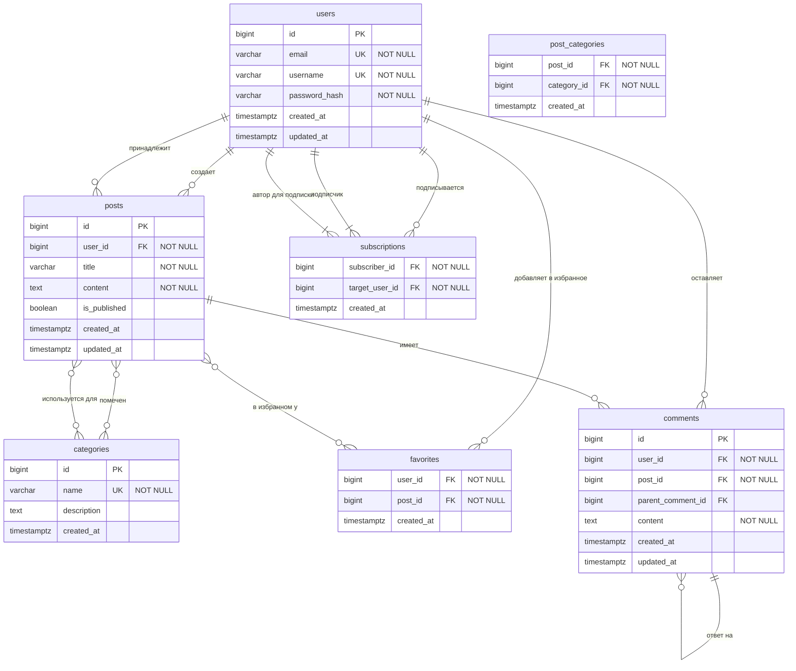

# ER-диаграмма базы данных блога

```mermaid
erDiagram
    users {
        bigint id PK
        varchar email UK "NOT NULL"
        varchar username UK "NOT NULL"
        varchar password_hash "NOT NULL"
        timestamptz created_at
        timestamptz updated_at
    }
    
    posts {
        bigint id PK
        bigint user_id FK "NOT NULL"
        varchar title "NOT NULL"
        text content "NOT NULL"
        boolean is_published
        timestamptz created_at
        timestamptz updated_at
    }
    
    categories {
        bigint id PK
        varchar name UK "NOT NULL"
        text description
        timestamptz created_at
    }
    
    post_categories {
        bigint post_id FK "NOT NULL"
        bigint category_id FK "NOT NULL"
        timestamptz created_at
    }
    
    favorites {
        bigint user_id FK "NOT NULL"
        bigint post_id FK "NOT NULL"
        timestamptz created_at
    }
    
    comments {
        bigint id PK
        bigint user_id FK "NOT NULL"
        bigint post_id FK "NOT NULL"
        bigint parent_comment_id FK
        text content "NOT NULL"
        timestamptz created_at
        timestamptz updated_at
    }
    
    subscriptions {
        bigint subscriber_id FK "NOT NULL"
        bigint target_user_id FK "NOT NULL"
        timestamptz created_at
    }

    users ||--o{ posts : "создает"
    users ||--o{ comments : "оставляет"
    users ||--o{ favorites : "добавляет в избранное"
    users ||--o{ subscriptions : "подписывается"
    posts ||--o{ comments : "имеет"
    posts }o--o{ favorites : "в избранном у"
    posts }o--|| users : "принадлежит"
    posts }o--o{ categories : "помечен"
    categories }o--o{ posts : "используется для"
    comments ||--o{ comments : "ответ на"
    subscriptions }|--|| users : "подписчик"
    subscriptions }|--|| users : "автор для подписки"
```